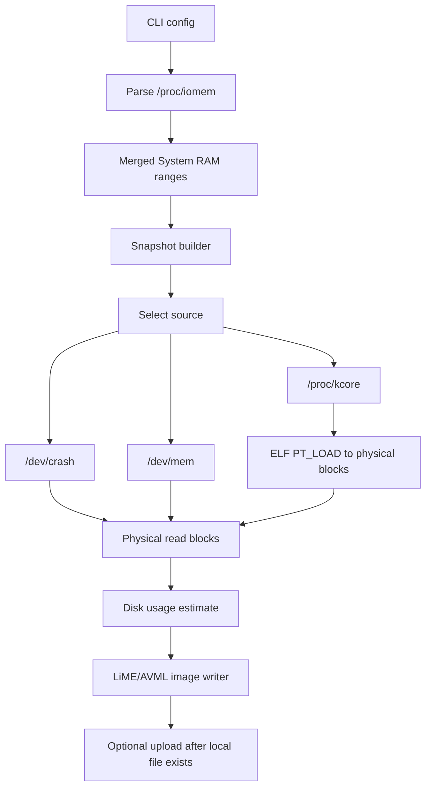

# Physical Acquisition Architecture

## How AVML Acquires Physical Memory

AVML's physical acquisition pipeline is:



The design centers on physical address ranges. Everything upstream produces physical ranges; everything downstream writes those ranges as image blocks.

## Range Discovery From `/proc/iomem`

AVML reads `/proc/iomem` and keeps only top-level `System RAM` lines. Indented child lines are ignored, even when they also say `System RAM`.

Example accepted line:

```text
00100000-3ffeffff : System RAM
```

Example ignored line:

```text
  03000000-0b0fffff : System RAM
```

Why this matters:

- Top-level ranges describe the physical RAM spans to acquire.
- Child ranges describe subregions and should not be double-counted.
- Some kernels expose zeroed address ranges when permissions are insufficient; AVML treats `0-0` System RAM as a CAP_SYS_ADMIN failure.

Porting rules:

- Preserve line filtering exactly for compatibility.
- Preserve fixture behavior before changing range-end semantics.
- Use deterministic sort and merge.
- Keep arithmetic saturating or checked around range sizes.

## Memory Sources

### `/dev/crash`

Role:

- Read-only view of physical memory, often present on RHEL-like systems.
- Reads must be page aligned and one page at a time.

AVML behavior:

- First source tried when writing to a normal file.
- End of each range is truncated down to a 4 KiB page boundary.
- Source reads are page-buffered through `align_src`.

GOFVML implications:

- Implement a source adapter that enforces page-aligned read loops.
- Preserve truncation behavior.
- Report truncation in debug/verbose logs because it can silently drop tail bytes.

### `/proc/kcore`

Role:

- Virtual ELF core dump of kernel memory.
- Can expose physical memory through PT_LOAD segments.

AVML behavior:

- Considered usable only if metadata size is greater than `0x2000` and it can be opened.
- Opened as an ELF stream.
- PT_LOAD segments are sorted by virtual address.
- A single offset is computed from the first PT_LOAD virtual address and first physical memory range start.
- Each PT_LOAD segment is translated into a physical block.
- Requested RAM ranges are intersected against translated blocks.

GOFVML implications:

- Use Go's `debug/elf` if it can parse `/proc/kcore` as needed, or a targeted ELF program-header parser if `debug/elf` assumes regular files in ways that fail on kcore.
- Treat kcore mapping as a separate, heavily tested component.
- Support partial intersections where one RAM range spans multiple PT_LOAD segments.
- Add diagnostics for locked-down or undersized kcore.

### `/dev/mem`

Role:

- Read-only physical memory view, if kernel policy permits.

AVML behavior:

- Third fallback source.
- Offset equals physical address.
- Range is copied without `/dev/crash` truncation.
- Reads still use page-buffered alignment because source canonicalizes to `/dev/mem`.

GOFVML implications:

- Expect `CONFIG_STRICT_DEVMEM` and `CONFIG_IO_STRICT_DEVMEM` to limit useful reads.
- Try it after safer/more complete options.
- Distinguish open failure from read failure in errors.

### Raw Source

Role:

- Internal/test/manual source path that behaves like physical memory file.

AVML behavior:

- `Source::Raw(PathBuf)` exists but is skipped by CLI value enum.
- `Snapshot` can use it programmatically.

GOFVML implications:

- Keep a raw source adapter for tests and conversion tooling.
- It allows deterministic acquisition tests without privileged devices.

## Source Selection Rules

AVML has two selection modes.

Normal file output:

1. Try `/dev/crash`.
2. Try `/proc/kcore`.
3. Try `/dev/mem`.
4. Return an aggregate error if all fail.

Stdout output:

1. Probe and select `/proc/kcore` if usable.
2. Else select `/dev/crash` if openable.
3. Else select `/dev/mem` if openable.
4. Else fail before writing.

The stdout case is different because once bytes are written, AVML cannot restart the image with a different source.

GOFVML should implement the same distinction. It should also expose a `--source auto` default and explicit source paths:

- `--source /dev/crash`
- `--source /proc/kcore`
- `--source /dev/mem`
- `--source raw:/path/to/file` for tests and advanced use

## Block Model

AVML's internal image block is:

```text
Block {
  offset: source byte offset to seek/read from,
  range: physical address range represented in output header
}
```

This distinction is crucial for `/proc/kcore`, where source file offset is not the same as physical address.

GOFVML should keep this model:

```go
type Block struct {
    Offset uint64
    Range  phys.Range
}
```

Recommended invariants:

- `Range.Start < Range.End`.
- `Offset` is the source position corresponding to `Range.Start`.
- `Range` is always physical address space for physical acquisitions.
- Source adapters own any special alignment requirements.

## Kcore Translation Algorithm

AVML algorithm, restated:

1. Parse PT_LOAD program headers.
2. Sort by `p_vaddr`.
3. Let `first_vaddr = first_segment.p_vaddr`.
4. Let `first_start = first_iomem_range.start`.
5. Let `start = first_vaddr - first_start`.
6. For each PT_LOAD segment:
   - `entry_start = p_vaddr - start`
   - `entry_end = entry_start + p_memsz`
   - block range is `entry_start..entry_end`
   - source offset is `p_offset`
7. For each desired RAM range, intersect it with the translated kcore blocks.
8. Emit blocks with adjusted source offsets.

Intersection behavior:

- If a memory range is fully contained in one kcore block, emit one block.
- If a memory range starts in one kcore block and continues beyond it, emit a partial block and continue matching the remaining tail.
- If a kcore block does not include the current start, skip it.

Porting caveat:

- AVML has a TODO noting range inclusivity is awkward. Preserve tests first; then decide whether to formalize exclusive-end behavior.

## Disk Usage Preflight Placement

AVML creates/opens the image file, then checks disk usage before writing data.

This ordering matters because percentage checks query the filesystem containing the destination. GOFVML should:

- Resolve/create the destination first.
- Call disk usage estimate using destination path.
- Fail before reading memory blocks if estimate exceeds limits.
- Make checks best effort and documented as estimates.

## Read Strategy

AVML has two read modes:

- Aligned source: read exact 4 KiB pages into a buffer.
- Unaligned source: bounded stream copy.

The aligned mode is selected by canonical source path matching `/dev/crash`, `/dev/mem`, or `/proc/kcore`.

GOFVML should avoid tying alignment only to canonical path. Put it on the source adapter:

```go
type Source interface {
    ReadAtBlocks(block Block, w io.Writer) error
    Alignment() AlignmentPolicy
    Close() error
}
```

But keep path-based compatibility for initial implementation:

- Physical device source: page read loop.
- Raw file source: normal copy.
- Kcore source: page read loop unless tests prove normal copy is safe.

## Error Behavior

AVML wraps source failures with the source name and accumulates fallback errors. This is valuable in incident-response workflows because operators need to know whether they hit lockdown, permission failure, strict devmem, or disk limits.

GOFVML should use structured errors:

- `ErrPermission`
- `ErrLockedDown`
- `ErrSourceUnavailable`
- `ErrReadFailed`
- `ErrDiskEstimateExceeded`
- `ErrUnsupportedFormat`
- `ErrShortRead`

The CLI should print a compact error plus a cause chain. The library should return typed errors suitable for testing.

## Security-Sensitive File Handling

AVML's image output uses:

- `0600` mode.
- `O_NOFOLLOW`.
- create/truncate.

GOFVML should use:

- `unix.Open` or `os.OpenFile` plus platform-specific flags through `golang.org/x/sys/unix`.
- A helper `OpenPrivateNoFollow(path string) (*os.File, error)`.
- No symlink-following for output image creation.

For PID dumps, apply the same output hardening.

