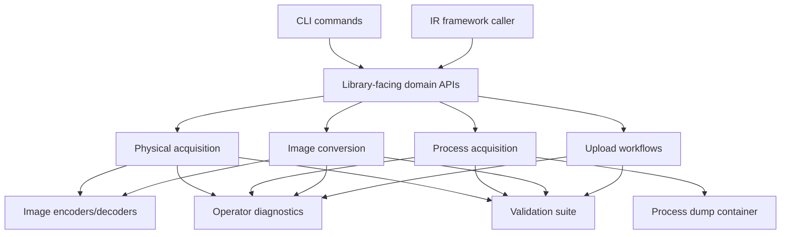

## Context

GOFVML is planned as a Go-based Linux volatile memory acquisition tool with two equally important entry points: standalone CLIs and importable Go packages for larger incident-response systems. The existing `docs/avml-rewrite-plan` corpus defines the architecture, compatibility targets, and implementation roadmap, but OpenSpec currently has no capability contracts. This change converts that planning into dedicated feature boundaries that can guide implementation and review.

The current design constraints are:

- Physical acquisition must preserve AVML-compatible behavior for Linux memory sources, LiME output, AVML-compressed output, zero-block skipping, source fallback, and Volatility 3 usability.
- PID-scoped process acquisition is a sibling mode, not a modifier on the physical acquisition pipeline.
- CLI commands must be thin adapters over library-style APIs.
- Privilege failures, Linux hardening, process races, partial reads, and format limitations must be visible to operators and callers.
- Tests are part of the architecture, not a cleanup task after implementation.

## Goals / Non-Goals

**Goals:**

- Define stable feature contracts for GOFVML's core software architecture.
- Keep product capabilities DRY by making OpenSpec the requirement source of truth and existing docs the supporting rationale.
- Separate feature responsibilities so code can grow without physical acquisition, process acquisition, conversion, upload, diagnostics, and validation becoming tangled.
- Make every capability testable before implementation starts.
- Preserve a path for public API stability without exposing internal implementation packages too early.

**Non-Goals:**

- Implement Go code in this change.
- Promise Windows or macOS acquisition support.
- Add kernel modules, kernel agents, eBPF collection, memory writes, or live cloud streaming in the first feature set.
- Make PID dumps equivalent to full physical memory images.
- Stabilize every public Go package before the first implementation review.

## Decisions

### 1. OpenSpec owns requirements; rewrite docs provide rationale

OpenSpec specs will define normative behavior using SHALL/MUST language. The existing docs remain valuable design background, source analysis, and implementation guidance.

Alternatives considered:

- Keep all requirements in `docs/avml-rewrite-plan`: lower process overhead, but creates source-of-truth drift once implementation starts.
- Move all docs into OpenSpec: reduces duplication, but loses useful narrative context and makes specs too bulky.
- Recommended: use OpenSpec for contracts and keep docs for rationale. This is explicit, DRY enough, and practical.

### 2. Feature boundaries follow forensic workflows, not package names

Capabilities are defined as `physical-acquisition`, `process-acquisition`, `image-conversion`, `upload-workflows`, `library-api`, `operator-diagnostics`, and `validation-suite`. Code packages can evolve under these contracts.

Alternatives considered:

- Define one monolithic `gofvml` spec: simple to create, but hard to test, review, or change safely.
- Define specs per Go package: maps neatly to code, but package names are lower-level and likely to move.
- Recommended: define user-visible and API-visible capabilities. This keeps specs stable while allowing implementation details to change.

### 3. CLI and library share behavior through one domain layer

CLI commands must call the same acquisition, conversion, upload, and diagnostic APIs available to Go callers. The CLI is responsible for parsing flags, validating user intent, and formatting output, not duplicating business behavior.

Alternatives considered:

- Build CLI first, extract packages later: fast start, but creates duplicated behavior and unstable public APIs.
- Build broad public packages first: clean interface goal, but risks over-engineering before code proves itself.
- Recommended: build library-shaped internal/domain APIs first, expose public packages as contracts settle. This is engineered enough without locking premature abstractions.

### 4. Process acquisition is a sibling mode

PID-scoped dumping uses `/proc/<pid>/maps`, `/proc/<pid>/mem`, process metadata, partial-read events, and a native process artifact format. It must not reuse LiME semantics as if virtual address ranges were physical memory ranges.

Alternatives considered:

- Add `--pid` to physical acquisition internals: superficially small, but mixes incompatible data models.
- Emit raw process memory only: easy to inspect, but loses mappings, permissions, paths, and errors.
- Recommended: sibling process mode with a metadata-rich `gofvml-process-v1` container and optional raw segment exports later.

### 5. Diagnostics and validation are dedicated features

Privilege-sensitive acquisition fails in expected ways on hardened Linux systems. Those failures are product behavior and must be specified, tested, and exposed through structured results.

Alternatives considered:

- Treat diagnostics as log messages in each feature: easy locally, but inconsistent and hard for library consumers.
- Treat validation as CI-only implementation detail: risks compatibility regressions and untested privileged flows.
- Recommended: give diagnostics and validation their own specs so all feature work must integrate with them.

### 6. First implementation scope decisions

The first implementation will use internal domain APIs first, with CLIs built as adapters over those APIs. Public `pkg/gofvml/*` packages can be promoted after the first API review once concrete behavior has proved stable.

The first PID dump artifact will be the single-file `gofvml-process-v1` container with metadata and index support, rather than a temporary raw-directory-only format. Raw segment export can still be added later as an interoperability option.

The first upload milestone will exclude Azure. HTTP PUT remains the required initial upload path, and S3 bucket upload is a desirable later extension if the upload abstraction stays destination-neutral.

The first conversion milestone will prioritize AVML-compatible default behavior. Optional strict AVML-compressed trailer validation can be added after compatibility tests are green.

The Go module path for the first implementation will be `github.com/RabbITCybErSeC/gofvml`.

## Architecture Flow

## Risks / Trade-offs

- [Risk] Capability specs duplicate existing docs → Mitigation: specs state normative behavior only; docs keep deeper rationale and implementation notes.
- [Risk] Public API contracts stabilize too early → Mitigation: require CLIs to use library-style APIs while allowing initial concrete packages to remain internal until reviewed.
- [Risk] AVML compatibility conflicts with stricter GOFVML validation → Mitigation: default modes preserve compatibility; stricter validation can be an explicit option where needed.
- [Risk] PID dumping creates expectations of full Volatility compatibility → Mitigation: specs require explicit metadata and diagnostics that distinguish virtual process artifacts from physical images.
- [Risk] Privileged validation is hard to automate in normal CI → Mitigation: split unprivileged fixture tests from explicitly privileged host validation scripts and matrices.

## Migration Plan

1. Land this OpenSpec change as the initial requirement baseline.
2. During implementation, build each phase against the relevant capability specs.
3. When code exists, add or modify specs before changing feature behavior.
4. Archive the change after specs are accepted into `openspec/specs`.

Rollback is simple at this stage: remove or revise this OpenSpec change before implementation depends on it.

## Open Questions

- Should S3 upload be specified in this change as a later explicit capability, or left as a backlog candidate after HTTP PUT lands?
